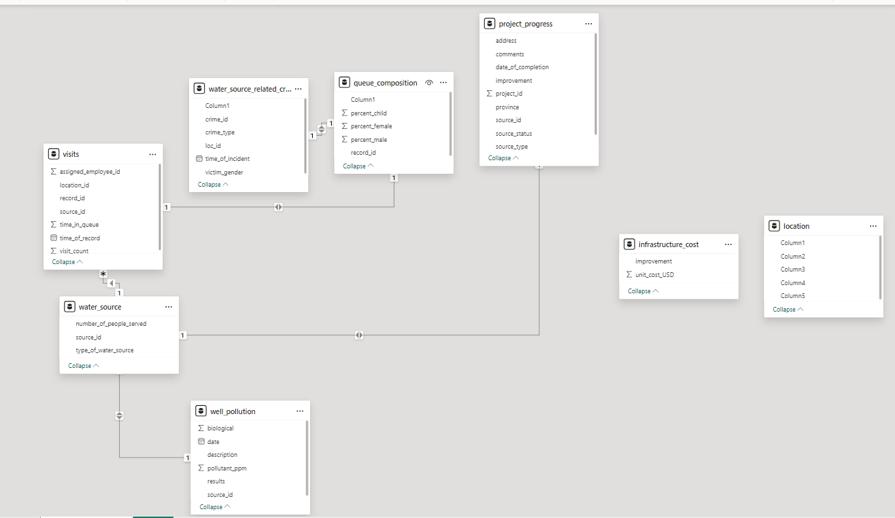

# Visualizing the currents of change in Maji Ndogo

## Introduction

This project aims to provide a comprehensive analysis of water access and source utilization in the regions of Maji Ndogo. By visualizing queue compositions of men, women, and children over different days and across various provinces, we can understand how different demographics are accessing these vital resources. Using Power BI, we explore water usage patterns, highlighting the gender distribution in queues at multiple water sources, including wells, rivers, and shared taps. This approach offers insights into potential disparities in access and allows us to identify days with longer queues and higher demand.

Beyond queue analysis, the project delves into environmental factors, specifically water source pollution across the provinces. By tracking pollution levels, we can identify sources that require immediate attention and repair.Through these visualizations, stakeholders can make informed decisions and allocate the necessary budget for maintaining and improving water access infrastructure.

**_Disclaimer_**: All datasets and reports do not represent any company, institutions or country but just a fictional dataset to demonstrate capabilities of power BI

## Problem Statement
1. Which days of the week have consistently longer queues compared to weekends?
2. What is the percentage of children in both long and short queue days, and how is this related to the presence of women in the queue?
3. What is the average composition of queues on various days?
4. What are the average queue times per hour of the day?
5. Which day of the week has the highest queue times overall?
   

## Power BI concepts demonstrated
- Modelling
- Filters
- Visualization

## Data Sourcing

Downloaded the csv files from ALX Explore AI Course and extracted it into power bi for cleaning, analysis and visualization.
Data used in this project:

[Md_water_services_data.xlsx](https://github.com/lisaogeya/Visualizing_the_currents_of_change_in_Maji_Ndogo/blob/main/Md_water_services_data.xlsx)

## Data Modelling

- Automatically derived relationships are adjusted to remove and replace unwanted relationships within the model.

Auto model                            |                    Adjusted model
:----------------------------------------:| :----------------------------------------:        
                   |      

- In the locations table. None of the column names (or headers) were imported correctly. So we changed that to enable relationships be established.
  
- In the queue_composition table, removing the first column establishes the relationships.
- In the water_source_related_crimes table, removing the first column to connect the table to the rest of the model.
- Linked water_source_related_crime table to location table using location_id .
- In this model:
   - There are 4 dimension tables to the visits fact table.
   - Project_progress and water_source_related_crimes are fact tables on their on.
- Thus the model is a multi-star schema.

## Data Transformation
- In the visits table, new columns, day_name and hour are extracted from the time_of_record column

## Analysis and Visualizations
**National Overview of distribution of water sources**

**Insights**
- 

**Average Queue times**

